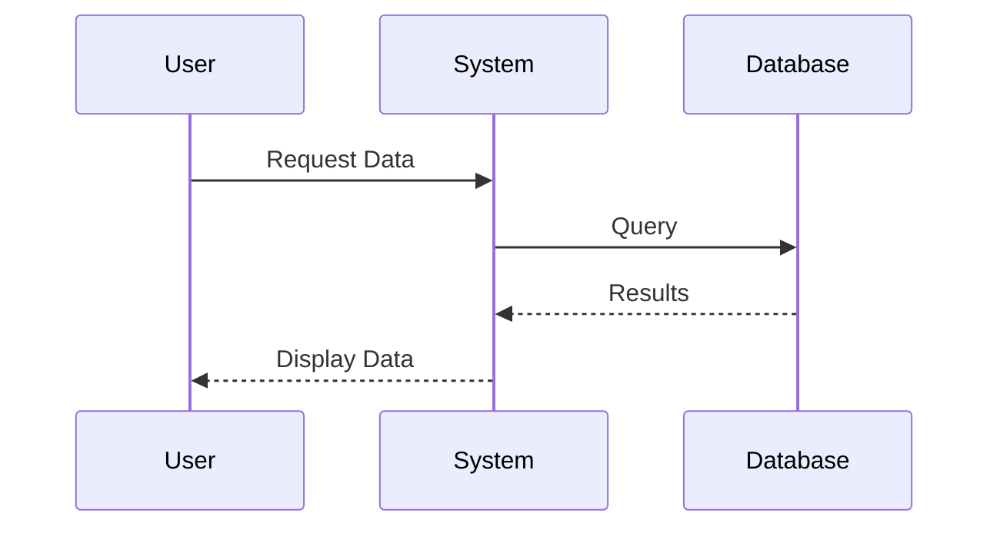
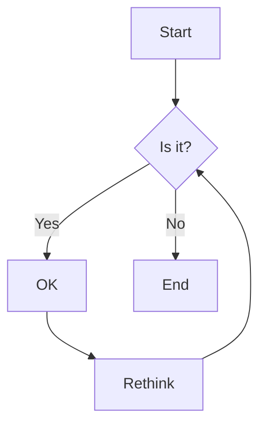
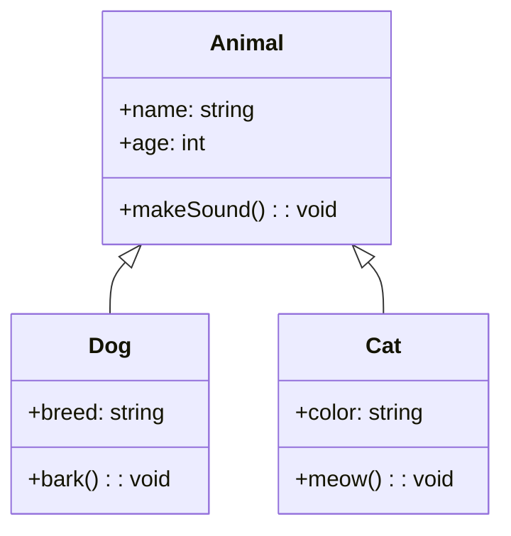
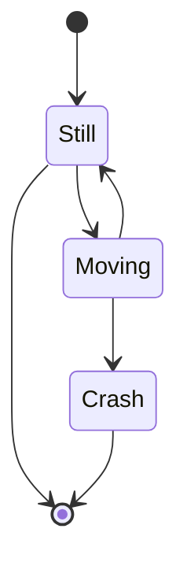
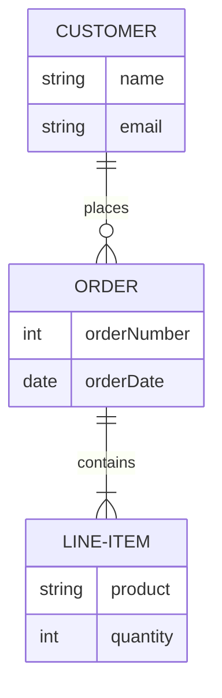

# Sample Markdown with Mermaid Diagrams

This file contains various Mermaid diagrams for performance testing.

## Sequence Diagram

## Flowchart

## Class Diagram

## State Diagram

## Entity Relationship Diagram

